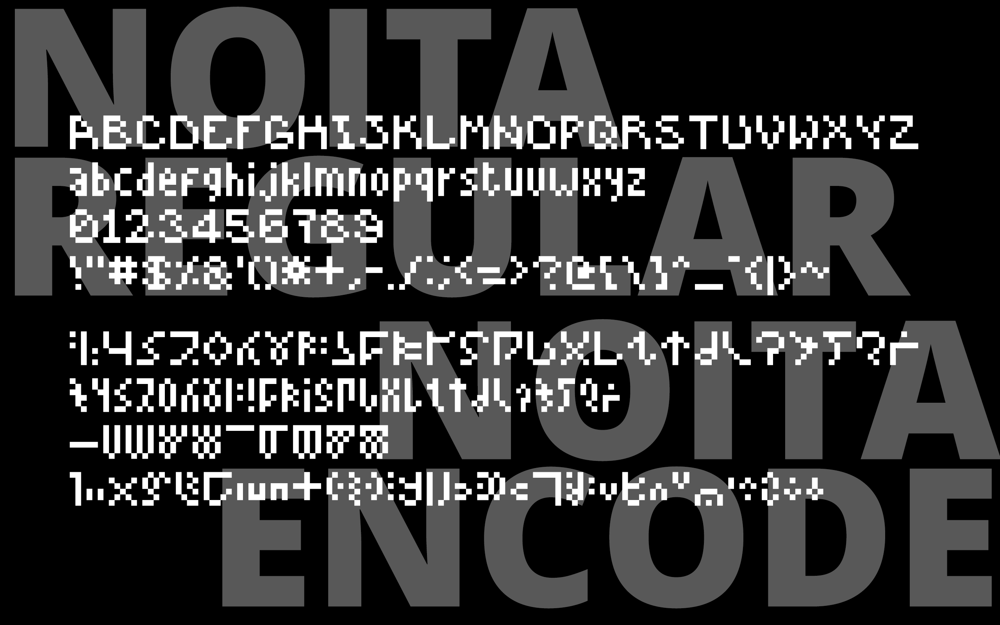
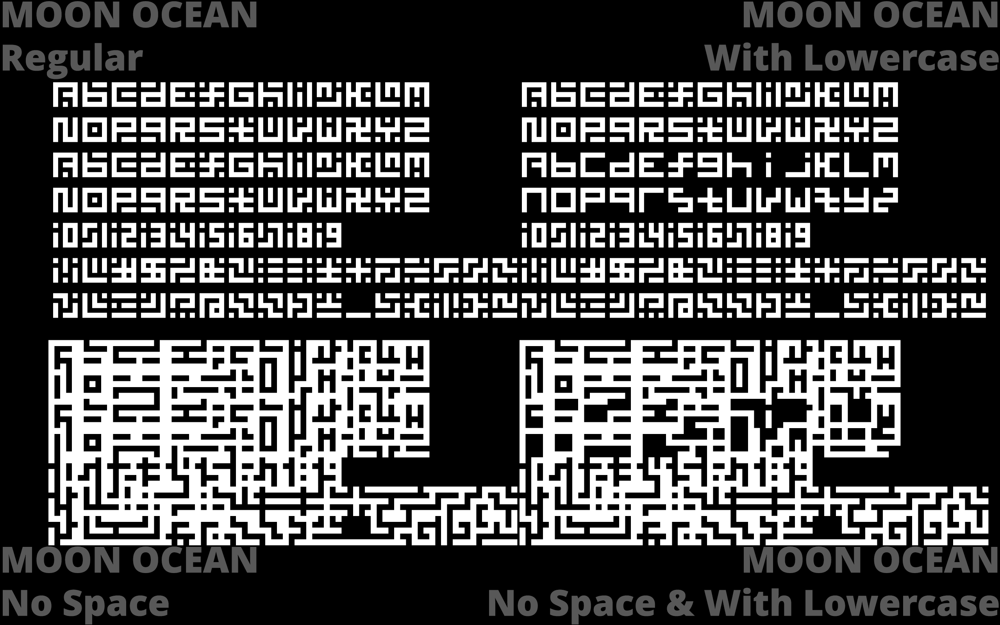

这是存放我做的其他字体的仓库。如果你想找我做的《少女终末旅行》中出现的“终末文字”的话，请[前往这个仓库](https://github.com/AZuReS3MiZ/ShuumatsuMonji)。 
This category is where I place my other font made by myself. If you want to download the Shuumatsu Monji from Girl's Last Tour, please [GO THERE](https://github.com/AZuReS3MiZ/ShuumatsuMonji).

# Noita字体

这两种字体是来自游戏[Noita](https://store.steampowered.com/app/881100/Noita/)的字体。 
NoitaRegular是游戏正常使用的字体，而NoitaEncode是游戏中密文使用的字体。 
(请注意滥用这种字体可能会受到版权争议)  

These two fonts are from game [Noita](https://store.steampowered.com/app/881100/Noita/). 
NoitaRegular is the font used for normal gameplay, while NoitaEncode is the font used for encrypted text within the game. 
(Please note that misuse of this font may be subject to copyright disputes) 

## 预览

# MoonOcean字体

“月海”字体是我从一首来自Frums的音乐的封面的图片得到灵感做的字体。 
MoonOcean font was inspired by an image from the cover of a piece of music by Frums. 

 
[前往SoundCloud收听the end of this world, and the girl who crossed the moon ocean.](https://soundcloud.com/frums/the-end-of-this-world-and-the-girl-who-crossed-the-moons-oceans) 

这种字体分为四个版本。 
Regular: 常规（我认为这个字体本来应该的样子） 
L：小写字符有区别于大写字符的字形 
NS: 去掉了行与行、字符与字符之间的空隙（纯好玩，请注意这种字体没有辨识度，不应作为日常生活中使用的字体） 
LNS: 包括L与NS的特性，即有小写字符，没有空隙。  

This font comes in four versions. 
Regular: Standard (what I believe this font should look like) 
L: Lowercase characters feature distinct glyphs from uppercase letters 
NS: Removes spacing between lines and characters (purely for amusement; note this variant lacks legibility and should not be used for everyday purposes) 
LNS: Combines L and NS characteristics, featuring lowercase glyphs with no inter-character spacing. 

## 预览
